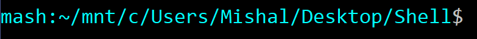
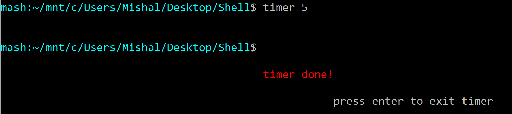
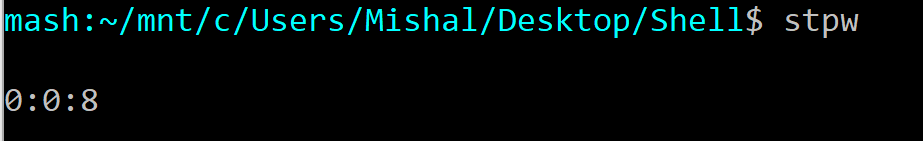
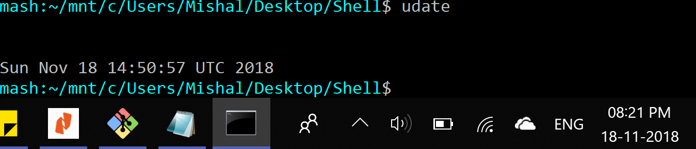
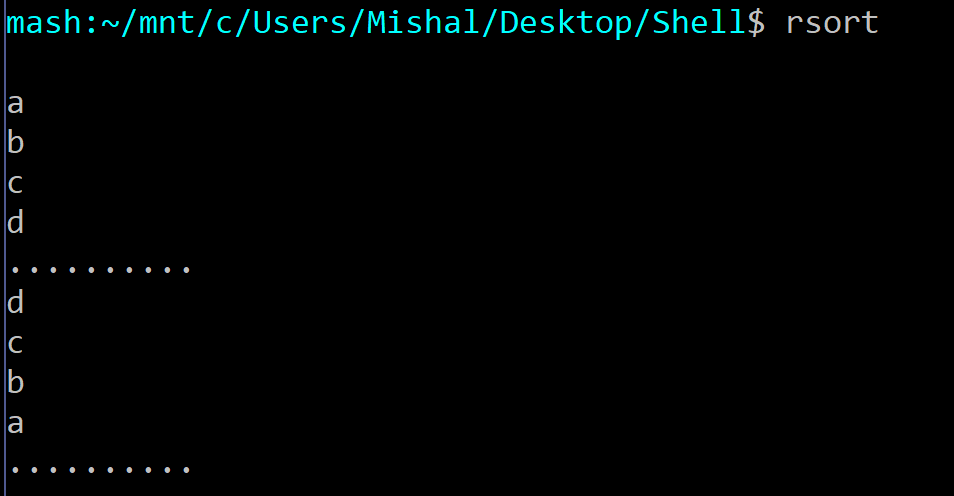
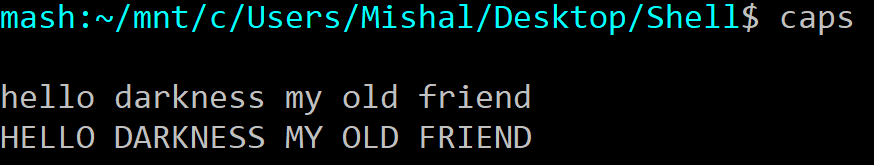
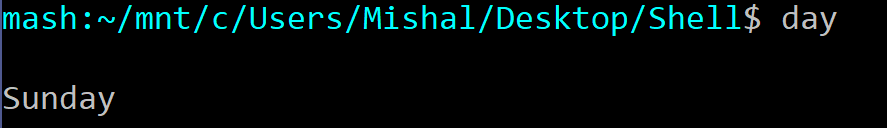

# Linux-Shell
PRE-REQUISITES:

1.)Linux Based system

2.)C compiler such as gcc

HOW TO RUN:

Step 1 : Go to terminal and compile by typing in `gcc shell.c`

Step 2 : Execute with `./a.out`

Your terminal should show up in cerulean blue along with the details of your current directory:

Along with the basic functionality of a LINUX shell, our custom shell also has the following features:

1.)Timer:
Sets the timer for a given number of options and notifies the user after the time elapses.

Command is : $`timer <seconds> [m]`

2.)Stop Watch:
Stop watch begins and shows time elapsed till Enter or any key is pressed.

Command is : $`stpw`

3.)History Management:
Command history management with Windows style bi directional scrolling with up and down arrow keys.

Aliases provided:-

1.)udate : Displays the current date and time in UTC time zone
Command is : $`udate`

2.)rsort : Reverse sort. Sorts anything and everything in reverse :)
Command is : $`rsort`

3.)caps : capitalizes anything and everything (as you can see this is a recurring theme in our project)(you can display your files in directory in all uppercase, and your file contents... pretty exciting)
Command is : $`caps`

4.)day : shows the current day in the week
Command is : $`day`

